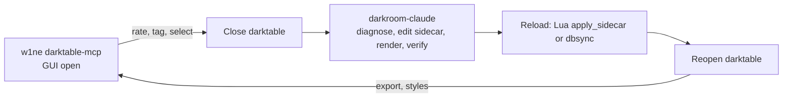

# Research: reuse or contribute to w1ne/darktable-mcp instead of duplicating

Issue: #5. Status: research done, decision below. Run on 2026-10-03 with darktable 5.6.0
(macOS app bundle, arm64), Python 3.13, `w1ne/darktable-mcp` at commit `a6a8686` (package
version from `pyproject.toml` dynamic, MCP SDK 2.x). Everything ran against a throwaway
library and config dir (`--library` and `--configdir` in a temp directory, one CC0 Sony A7 III
RAW), never `~/.config/darktable`. What was not verified is listed at the end.

## Question

Should darkroom-claude recommend w1ne/darktable-mcp for library operations, and contribute
verified layouts or the sidecar reload path there instead of duplicating them?

## Decision

1. **Recommend it, as an optional companion, for library work with the GUI open** (ratings,
   tags, notes, collections, styles, export). Those are things darkroom-claude does not do and
   should not reimplement. Verified on stock darktable 5.6.0, no patch needed.
2. **Do not route anything that edits module params through it.** That part needs a patched
   darktable fork (GPL-3.0, 27 commits ahead and 1025 behind darktable master, issues
   disabled, not buildable here), and it assumes a live GUI session, which is the opposite of
   our "darktable closed, measure by render" method.
3. **Do not contribute verified layouts to it.** It never needs them: the patched build reads
   and writes params by field name through darktable's own introspection. Our
   `tools/modules.json` has nothing to offer that code path. (The same is true of the darktable
   project's own MCP server, see "A bigger finding".)
4. **Contribute the sidecar reload path** (`image:apply_sidecar`, issue #2). It fits their
   design rule (official Lua API, no `library.db`), it replaces the manual "read sidecar files"
   step their README asks for, and a probe in a live GUI showed it works (below).
5. **Do not offer `dbsync.py` upstream.** Their README: "Any change that reads or writes
   `library.db` directly will be rejected."
6. **Re-scope the long term bet.** darktable master now ships its own `darktable-mcp`
   (merged 2026-08-14, not in 5.6.x). It overlaps #1 and #2 more than w1ne's does. A
   follow-up issue should evaluate it on a nightly (draft at the end).

## Method

- Web search (darktable MCP servers, Lua API limits), then read of the repo
  `w1ne/darktable-mcp` from a local clone: README, `LICENSE`, `NOTICE.md`, `pyproject.toml`,
  the Lua plugin (`darktable_mcp/lua/darktable_mcp.lua`, 2014 lines), `server.py` (tool
  schemas, 9321 lines), `docs/`, CI files. GitHub metadata through `gh` (issues, PRs, the
  fork it depends on).
- Install in a venv (`pip install` from the clone), plugin installed with the package's own
  `install()` function pointed at a temp home (the CLI command writes to the real
  `~/.config/darktable`, so it was not run), HOME and `XDG_CACHE_HOME` pointed at temp dirs for
  the server process, GUI darktable started with `--configdir` and `--library` in the temp dir.
- Tools driven through a small MCP stdio client (`mcp` SDK `ClientSession`), then a probe of
  the reload path: a throwaway Lua method `reload_sidecar` added to the temp copy of their
  plugin (not upstream code) calling `image:apply_sidecar(image.sidecar)`.

## What the project is

| Item | Finding |
|---|---|
| Purpose | MCP server (Python, `mcp>=2,<3`) driving darktable through `darktable-cli` and the Lua API. 54 tools (counted from `tools/list`). |
| License | MIT (`LICENSE`, copyright w1ne). The editing tools come from a merged fork (`rfordinal/darktable-mcp`, MIT, see `NOTICE.md`). |
| Activity | Created 2026-04-25, last push 2026-10-02, 129 commits, 13 stars. 10 PRs, all merged or closed by the owner. 0 issues, ever. No `CONTRIBUTING.md`. |
| Contribution rules | README only: "Contributions welcome. Any change that reads or writes `library.db` directly will be rejected." Design rule: official darktable APIs only, tools returning data to the AI must be headless. |
| Packaging | Not on PyPI. `pip install git+https://github.com/w1ne/darktable-mcp`. |
| Lua bridge | `darktable-mcp install-plugin` copies `darktable_mcp.lua` to `~/.config/darktable/lua/` and appends `require "darktable_mcp"` to `luarc`. Inside the user's running GUI a worker polls `$XDG_CACHE_HOME/darktable-mcp/` for `request-<uuid>.json`, runs the method, writes `response-<uuid>.json`. The Python side (`Bridge.call`) writes and polls those files. Poll cadence 100 ms to 1 s adaptive. |
| Stock darktable | Library tools, ratings, styles, export, camera import, preview extraction: yes. `open_image_in_darkroom` also "works" on stock. |
| Patched darktable | `get_params`, `set_params`, `list_modules`, masks, retouch, viewport, LUT preview: need `darktable.develop`, which exists only in the `agentic-mcp` branch of `rfordinal/darktable-agentic` (fork of darktable, GPL-3.0). |
| Sidecar vs library | Same conflict as P9 acknowledged: "For photos already in the library, darktable trusts its database over the sidecar", fixed by a manual lighttable "read sidecar files" step. `apply_ratings_batch` patches only `xmp:Rating` in existing XMP, never replaces. |
| `apply_sidecar` | Not used anywhere (grep over the whole repo returns nothing). `image.sidecar` is read, for duplicate aware export paths. |
| Params layouts | None in the repo. The patched C side returns `{value, min, max, default}` per scalar field from darktable's introspection and clamps on write. Arrays, curves and masks are scalar-only or handled apart, per comments in the plugin. |

## Results of the library tools (stock darktable 5.6.0)

| Tool | Result |
|---|---|
| `tools/list` | 54 tools, schemas load. |
| `view_photos`, `list_collections`, `list_styles` | OK on the imported test image (id, filename, rating, path, `xmp_path`; 534 styles). |
| `rate_photos` | OK. Rating 4 visible in `view_photos` and written to the sidecar (`xmp:Rating="4"`) by darktable. |
| `tag_photo`, `set_photo_note`, `get_photo_note` | OK. Tag `test\|mcp` appears in the sidecar. |
| `export_images` | Works once `darktable-cli` is on `PATH`. On macOS the app bundle is not on `PATH`: first call returned "darktable-cli executable not found in PATH". Output `A.jpg`, 400 px, one image, per-file JSONL written. Despite the name, `photo_ids` takes file paths: an integer id crashed with a `TypeError` ("Tool export_images crashed"). The schema description says paths, the name says ids. |
| `open_image_in_darkroom` | Reported "Opened image 1 in darkroom". |
| `get_params` | Clear error on stock: "requires patched darktable with the darktable.develop API". Library tools stay available. |

Not run: `import_batch`, `apply_preset`, `get_contact_sheet`, `apply_ratings_batch`,
`extract_previews`, camera import, HTTP mode, the segmentation sidecar services, the unit
test suite of the repo.

## Probe: `apply_sidecar` inside a live GUI (answers the GUI gap of #2)

Setup: GUI darktable 5.6.0, library with 11 history entries for one image. A new `exposure`
entry (+1.5 EV) was appended to the sidecar with `tools/xmp.py` (12 entries in the sidecar,
11 in the DB). Then the temp `reload_sidecar` bridge method was called.

| Step | DB `history` rows / `history_end` | Sidecar entries | Sidecar bytes |
|---|---|---|---|
| after the hand edit, GUI open | 11 / 11 | 12 | changed by me |
| after GUI restart (no reload yet) | 11 / 11 | 12 | unchanged |
| after `apply_sidecar` through the bridge (returned `true`) | 12 / 12, new row is `exposure` with the +1.5 EV blob | 12 | unchanged (same SHA-256) |
| after a clean quit of the GUI | 12 / 12 | 12 | unchanged |

Also observed, for P9: with the sidecar 1 entry ahead of the DB, a restart and then a clean
quit (AppleEvent quit) of the GUI did **not** rewrite the sidecar (same SHA-256 before and
after, `write_sidecar_files=on import`, the default). This matches the existing "not
reproduced" status of P9 and does not disprove it: editing the image in the darkroom after
the hand edit was not tried, and that is the case that would write the DB history back.

What this adds to `docs/research/lua-sidecar-reload.md`: `apply_sidecar` works from a Lua
method running in the interactive GUI, not only from a headless `darktable-cli --luacmd`, and
darktable did the DB write. Not checked: whether lighttable and darkroom redraw the new
history without a restart (no screenshot was possible).

## Overlap with darkroom-claude

| Topic | w1ne/darktable-mcp | darkroom-claude | Verdict |
|---|---|---|---|
| Rate, tag, note, collections, styles | Yes, through the live GUI | No | Use theirs, do not build. |
| Export | `darktable-cli` in an isolated config dir per worker, JSONL report, de-collided names | `tools/render.py` (isolated config, in-memory library, measurement) and the `darktable-export` skill (sRGB, EXIF, GPS, caption) | Overlap on the isolation trick and P1 (they also learned "exits 0 without writing"). Ours measures; theirs batches. Both fine. |
| Edit module params | Only with the patched fork, live darkroom, by name | `tools/xmp.py` append to the sidecar, `modules.json` layouts, stock darktable | Different models. Ours works on stock and is verified by render. No reuse. |
| Param layouts | None (introspection) | `modules.json`, `docs/module-params.md` | Nothing to contribute there. |
| Reload after an external edit | Manual "read sidecar files"; no tool | `dbsync.py`, Lua `apply_sidecar` researched in #2 | Contribute `apply_sidecar` as a bridge method. |
| Write `library.db` | Forbidden by design | `dbsync.py` (fallback) | Stays here, never upstream. |
| Safety when darktable is open | Needs the GUI open by design | `guard_darktable_open.py` blocks writes to `.xmp` and `library.db` while it runs | Conflict, see "Combining". Their own `apply_ratings_batch` writes `.xmp` through an MCP tool, which our hook (matches `Write`, `Edit`, `Bash`) cannot see. |
| Measurement (percentiles, clipping), subject box, framing | `get_preview` returns a PNG for the model to look at, no numbers | `render.py`, `subject.py`, `photo-diagnose`, `frame-for-social`, `darkroom-reviewer` | Ours only. |
| Masks, retouch, LUT preview, segmentation (SAM2, MODNet) | Yes, patched fork, optional services | No | Out of scope for us. |
| Camera import, previews, culling workflow | Yes (`gphoto2`, `rawpy`) | No | Use theirs. |

## A bigger finding: darktable now has its own MCP server

Found while searching, and not in the issue text. `darktable-org/darktable` master has
`src/mcp/` (RFC PR #21573 by andriiryzhkov, merged 2026-08-14, plus a library overhaul PR
#22196 merged 2026-09-07). The user manual for the development version documents
`darktable-mcp` under program invocation. Per its `src/mcp/README.md`:

- a separate binary linking `libdarktable`, built by default (`USE_MCP=ON`), stdio JSON-RPC,
  no Lua, no patched build, no GUI needed;
- introspection tools `list_modules`, `module_schema`, `decode_params`, `encode_params` (named
  fields, min, max, default, enums), so params by name without a hand table;
- `render` and `image_stats` with a `stack` of modules applied on top of an image
  (committed to history and sidecar for an `imgid`, scratch for a bare path), `get_history`
  decoded per module, `reset_history`;
- library tools (`import_images`, `list_images`, ratings, labels, styles, `export_images`),
  `--read-only` mode, in-memory library by default so it can run beside the GUI;
- real catalog mode needs the GUI to be closed, exactly our constraint.

It is not in the 5.6.0 bundle used here (`darktable-mcp` is absent from
`Contents/MacOS`), nor in the `release-5.6.1` tag (`src/mcp` returns 404 there). It is in the
`nightly` build (5.7.0+1149, a macOS arm64 dmg exists). It was not downloaded or run, so
nothing about its behaviour is verified, only its documentation. If it works as documented,
it makes both the patched fork and a large part of `modules.json` (#1) and `dbsync.py` (#2)
redundant for editing through `imgid`, because darktable itself writes history and sidecar.
It does not replace the measured render loop, the skills, or the framing tools.

## Combining (what goes in the README)

The order matters because of the one hard conflict: darkroom-claude edits only while darktable
is closed; w1ne/darktable-mcp library tools only work while it is open.

## What to contribute upstream (w1ne/darktable-mcp)

Nothing was opened or commented there. These are drafts for the owner of this repo to file
once the decision is accepted. Cross-references: #1 (layouts by name), #2 (sidecar reload).

| Item | Why it fits their rules | Link |
|---|---|---|
| `reload_sidecar` bridge method + MCP tool calling `image:apply_sidecar(image.sidecar)`, with a `NOT_IN_LIBRARY` result for unknown ids, wired into the `apply_ratings_batch` warning instead of the manual lighttable step | Official Lua API, no `library.db`. Probe above: DB history becomes the sidecar's in the live GUI. Needs Lua API 9.5.0 or newer (they target 5.6.0 / 9.7.0). | #2 |
| macOS: look for `darktable-cli` in `/Applications/darktable.app/Contents/MacOS` | Reproduced: fails on a stock macOS install. Our `tools/render.py:CANDIDATES` has the lookup. | none |
| Rename or alias `export_images.photo_ids` to a path argument | Integer ids crash with a `TypeError` instead of an error message. | none |
| `install-plugin --config-dir` | The command only writes `~/.config/darktable`, which makes a safe test run impossible. | none |
| Pitfall notes from `docs/pitfalls.md` that touch their tools: P1 (output never overwritten, they already `stat` outputs), P9 | Documentation only. | #2 |
| Module layouts | Not applicable: their C side uses introspection. If the patched fork's arrays and curves ever need a fixture, the blobs in `tools/modules.json` could serve as test data, only after #1 confirms them by render. | #1 |

## Not verified

- Anything about the patched darktable build (`rfordinal/darktable-agentic`): not built, so
  `set_params`, `get_params` on a real module, masks, retouch, viewport and LUT tools were not
  run. Only the stock-darktable error path was seen.
- The upstream `darktable-mcp` in darktable master: documentation read, binary never run.
- GUI redraw after `apply_sidecar`, and the darkroom-edit-after-hand-edit case of P9.
- Linux, Windows, darktable other than 5.6.0, Lua API versions older than 9.5.0.
- Several images per call, duplicates (`_01` sidecars), and images not in the library for
  `reload_sidecar` (the throwaway probe took one `image_id`).
- The behavior of their tools on a library with many images (only one image was imported).
- Whether the maintainer of w1ne/darktable-mcp wants the contributions: there is no issue
  tracker activity and no contributing guide, so response time is unknown.
- The `[vision]` extra (`rawpy`, `pyexiv2`) and the SAM2 / MODNet services.

Behaviors that cost time during the run, for whoever repeats it: SIGTERM and SIGINT did not
stop the GUI darktable (a kill was needed once); `osascript -e 'tell application "darktable"
to quit'` prints a "-128 cancelled" error but the quit does happen, a few seconds later; a
quit sent to a slow instance can land on the next instance started right after.

## Draft follow-up issue

Title: `research: evaluate darktable's built-in darktable-mcp (src/mcp) against modules.json and dbsync.py`

> Context: research in #5 (`docs/research/darktable-mcp.md`). darktable master (merged
> 2026-08-14, PR 21573) ships `darktable-mcp`, a headless binary with `module_schema`,
> `encode_params`, `decode_params`, `render` with a `stack`, `get_history`, and library tools.
> Not in 5.6.1, present in the nightly (5.7.0).
>
> Questions: (1) Do `encode_params` and `module_schema` reproduce `tools/modules.json` for
> the 15 listed fields (compare with the confirmed ones)? (2) After a `render` with a `stack`
> on an `imgid`, do `library.db` and the sidecar agree without `dbsync.py` or Lua? (3) Does it
> run on macOS from the nightly dmg, beside a closed GUI, with a throwaway `--configdir`?
> (4) Does `image_stats` give numbers comparable to `render.py`'s percentiles?
>
> Method: nightly build in a temp dir, `--read-only` first, throwaway library, same CC0 RAW.
>
> Outcome: either a README section on using it from darkroom-claude and a plan to retire the
> redundant parts when 5.8 ships, or a list of what it lacks.
