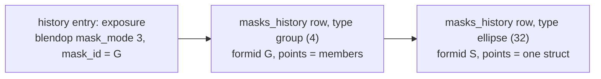

# Research: write drawn masks (geometry and masks_history)

Issue: #4. Status: research done, decision below. Everything here ran on darktable 5.6.0 (macOS
26.6, arm64) with the CC0 Sony A7 III sample RAW, in throwaway config dirs and libraries (never
`~/.config/darktable`). The darktable source read is the `release-5.6.0` tag. What was not tested
is listed at the end.

## Question

What is the exact binary layout of a drawn mask (ellipse, brush, path) in the sidecar
(`darktable:masks_history`) and in `library.db`, and can it be generated safely?

## Decision

**Yes, for ellipse, circle, path, brush, gradient and mask groups, with a hard rule: nothing is
written without a render check.** The layout is in `tools/modules.json` under `_masks`, one field at
a time, and each field marked confirmed names a render test in `tests/test_masks.py` that passes.
The unconfirmed ones keep `test: null`.

Evidence, in order of strength:

1. Blobs **darktable wrote itself** (its own benchmark sidecar, 3.x/4.x era, mask version 6) decode
   with this layout, repack to the same bytes, load in 5.6.0 and land on their own coordinates.
2. Masks **generated from scratch** by `pack()` go through darktable's own XMP writer and come back
   byte identical for all six form types, and `library.db` rows built in Python render pixel
   identical (max diff 0) to the ones darktable wrote on import.
3. Renders put each mask where the numbers say: ellipse centre within 0.002 of the requested
   fraction, bounding box within the feather width, rotation, border, group operators and opacity
   each moving the picture the expected way.

It does not make `dbsync.py` able to carry masks: that tool only syncs `history`, and a library
without `masks_history` rows applies the module to the **whole image**, silently (P10). Until a
tool writes the rows, reload mask edits through darktable (the Lua `apply_sidecar` route of #2,
or a plain `darktable-cli` import, both load the rows, see below).

## What exists (web search, before experimenting)

Found:

- darktable source, `src/develop/masks.h` and `src/develop/masks/*.c`: the point structs
  (`dt_masks_point_ellipse_t`, `_circle_t`, `_path_t`, `_brush_t`, `_gradient_t`, `_group_t`),
  the shape flags, and `DEVELOP_MASKS_VERSION 6`. The reader and writer of the XMP rows are in
  `src/common/exif.cc` (`_read_masks_v3`, `_set_xmp_dt_history`), the DB access in
  `src/develop/masks/masks.c` (`dt_masks_read_masks_history`, `dt_masks_write_masks_history_item`).
  The 5.6.0 tag already has an object (AI) mask bit, `1 << 8`.
- `src/tests/benchmark/darktable-bench-{3.4,3.6,3.8,4.2}.xmp` in the darktable tree: sidecars
  written by darktable with a `masks_history` of 11 forms (clone ellipse, circle, brush with 8
  nodes, path with 9 nodes, groups). This is the only darktable-authored mask data I found that
  can be read without a GUI, and the reference of this note.
- wmakeev/darkroom-xmp-tools (a Node native addon): copies darktable's structs to decode and
  encode circle, ellipse, path and gradient points. Its groups are marked "not supported yet", it
  has no render check and no DB side. Same layouts as found here.
- discuss.pixls.us, "Scripting module parametrization and masking" (2024): the question "add an
  exposure with an elliptical mask from a script" has no solution; the answer is to use styles and
  presets, and "mask manipulation might be an issue". The `src/lua/` directory of the 5.6.0 tag has
  no file for masks or forms (image, database, styles, tags, film, view, widgets and so on only).
- discuss.pixls.us, "Documentation of XMP-files darktable creates" (2018): asks for the
  base64/gzip format to be documented, no layout in it.
- darktable issue 22226 (RFC on soft alpha masks): confirms the storage model, a mask is "a
  fixed-size struct like any other form" in `masks_history.points`, reaching the XMP through the
  gzip + base64 encoder.
- Source reading only (not run): `data.style_items` has no mask columns and `mask_manager` items are
  skipped when a style is applied, so a style cannot carry a drawn mask.

Not found: a written description of the byte layout of any shape, any report of a hand generated
mask checked by render, any Lua or CLI way to create a drawn mask, a darktable-authored mask on a
sample I can render here. Nobody seems to have documented `blend_cst` or `mask_mode` as conditions
of a mask being used at all.

## How a mask is wired

- A module uses a drawn mask when its `blendop_params` has `mask_mode` 3 (bit 1 enabled + bit 2
  drawn, byte 0), `blend_cst` the module blends in (byte 4, 4 for scene-referred RGB such as
  `exposure`) and `mask_id` (byte 24) equal to the `formid` of a **group**. The group lists its
  members (`dt_masks_point_group_t`: `formid`, `parentid`, `state`, `opacity`); shapes never hang
  on the module directly.
- Sidecar, one `<rdf:li>` per form in `darktable:masks_history`, before `darktable:history`:
  `mask_num`, `mask_id`, `mask_type`, `mask_name`, `mask_version` (6), `mask_points`, `mask_nb`,
  `mask_src`. `mask_points` is the concatenation of `mask_nb` structs, encoded like `params`: lowercase
  hex, or `gz` + two digits + base64 of zlib (darktable compresses blobs over 100 bytes when asked;
  the reader takes both).
- `library.db`, table `masks_history(imgid, num, formid, form, name, version, points, points_count,
  source)`: the same fields, `points` and `source` as raw bytes (`form` = `mask_type`, `points_count`
  = `mask_nb`, `source` = `mask_src`, always 8 bytes).
- `mask_type` is a flag set: circle 1, path 2, group 4, clone 8, gradient 16, ellipse 32, brush 64,
  non-clone 128. A clone ellipse is 40; the shape is `type & ~(8 | 128)`.
- Every field is 4 bytes little-endian. Layouts (`f` float, `i` int):

| Shape | Point size | Fields |
|---|---|---|
| ellipse (32) | 28 B | `center_x f, center_y f, radius_a f, radius_b f, rotation f, border f, flags i` |
| circle (1) | 16 B | `center_x, center_y, radius, border` (all f) |
| path (2) | 36 B per node | `corner_xy, ctrl1_xy, ctrl2_xy, border_xy` (8 f), `state i` |
| brush (64) | 44 B per node | `corner_xy, ctrl1_xy, ctrl2_xy, border_xy` (8 f), `density f, hardness f, state i` |
| gradient (16) | 28 B | `anchor_xy f, rotation f, compression f, steepness f, curvature f, state i` |
| group (4) | 16 B per member | `formid i, parentid i, state i, opacity f` |

- Units (confirmed by render): centre and node coordinates are fractions of the image the module
  receives, **before crop** (x of the width, y of the height; a crop of x 0.1 to 0.9 moves an
  ellipse at 0.3 to 0.25 of the output). Radii are fractions of `min(width, height)`. `rotation` is
  in degrees, positive clockwise on screen. `border` is the feather beyond the radius, in the same
  unit when `flags` is 0, and a share of the radius when `flags` is 1 (0.1 with flags 0 and 0.5
  with flags 1 on a radius of 0.1 give the same picture).
- Group `state`: bit 4 inverts the mask, 8 / 16 / 32 make the member a union / intersection /
  difference with what precedes it. darktable writes 3 (use + show) for the first member and 3 plus
  the operator for the next ones. Bits 1 and 2 (use, show) are not read by the render: states 0, 1
  and 2 gave a pixel identical image.

## Method

1. Read the sources of the 5.6.0 tag (`masks.h`, the six shape files, `exif.cc`, `masks.c`,
   `blend.h`, `history.c`, `develop.c`) for the structs, the XMP reader/writer and the DB access.
2. Decode the darktable-authored sidecar (11 forms) with that layout. Every blob is exactly
   `mask_nb` times the struct size, circles are 16 B (not 20), groups point back to themselves.
3. Regenerate: `pack()` builds the same structs from named fields (read from `modules.json`),
   a sidecar carries exposure +2 EV through a group, and `render.py` renders it. The reference is
   the same history entry with the module switched off. The changed region is measured: bounding
   box, weighted centroid, principal axis angle.
4. Check the measure before trusting the layout. Ellipse at (0.3, 0.6), radii (0.15, 0.08), border
   0.05 on a 1200 px render: centroid (0.302, 0.602), bounding box x 0.167 to 0.433 and y 0.471
   to 0.731, against 0.167 to 0.433 and 0.470 to 0.730 predicted from the source formulas.
5. Get darktable to write masks itself. Not possible to author one headless (no Lua, CLI or
   style route), so two substitutes: the benchmark sidecar above (authored by darktable, on
   another image), and darktable's own serializer, reached by exporting a JPEG with
   `--apply-custom-presets true --conf plugins/lighttable/export/metadata_flags=2f`, which embeds
   `masks_history` written from its database.
6. DB side: import a sidecar into a file library with `darktable-cli`, read `masks_history` with
   sqlite, remove the sidecar and render from the DB, delete the rows, rebuild them in Python.

## Results

| Check | Result |
|---|---|
| darktable-authored blobs (ellipse x2, circle, path 9 nodes, brush 8 nodes, group) vs layout | size = `mask_nb` x struct, unpack then pack gives identical bytes |
| same blobs rendered on the sample | centres within 0.001 (ellipse 1, circle 2); path and brush bounding boxes contain their nodes within the feather |
| six generated forms through darktable's XMP writer | ids, types, counts, names and bytes identical (hex and gz both read back) |
| DB rows written by darktable on import | `points` = the struct bytes, `source` = 8 zero bytes, group row = 16 B per member |
| DB-driven render (sidecar removed) vs sidecar render | max diff 0 |
| rows rebuilt in Python vs rows darktable wrote | byte equal, render max diff 0 |
| library with the `masks_history` rows deleted | the module acts on the whole image (mean diff 77 from the masked render) |
| library with history but no `masks_history` rows, sidecar with masks next to the RAW | a plain `darktable-cli` run on that image loads the rows (2). Lua `apply_sidecar` hosted by another image, sidecar mtime set to 1970: also 2 rows; the same host run without the Lua script: 0 rows |
| ellipse rotation 0, 90, 30, -30 | wide, tall, leaning +24 and -24 degrees (principal axis of the changed region) |
| crop x 0.1 to 0.9 with an ellipse at 0.3 | centroid 0.2516 (0.25 expected); crop top 0.3 with y 0.5: 0.288 (0.286) |
| gradient, compression 0, rotation 0 / 90 / 180 / 270 | lights the top / left / bottom / right half (mean change at least 20 times the other half) |
| group opacity 0 / 0.5 / 1 | pixel identical to the module off / about half the effect / full |
| group union, intersection, difference of two overlapping discs | union covers both, intersection under a third of the union, difference about the first disc alone (ratios asserted) |

`tests/test_masks.py` runs these (26 tests, 3 without darktable, about 3.5 minutes with it).

## Pitfalls found

- **P10, a mask darktable cannot resolve is not an error.** A `mask_id` with no group row,
  `mask_mode` 2, `blend_cst` 0, and `mask_version` 7 all render exactly like the module with no mask:
  the effect lands on the whole image and the log says `params ok`. A group that lists a member
  with no row is the opposite: it selects nothing and the module does nothing. My first render did
  this (the neutral blend blob has `blend_cst` 0); I noticed because the centroid of the change was
  at the centre of the frame instead of at the ellipse.
- **P11, uppercase hex in `mask_points` crashes darktable-cli** (SIGSEGV, no output). The same slip
  in `params` only drops the module (P2).
- **Blob size must be `mask_nb` x struct size, exactly.** The readers do not check it. A 24 byte
  ellipse (flags missing) rendered with a different feather and a group with `mask_nb` 2 but one
  member rendered normally: both are out of bounds reads, undefined behaviour, which happened to
  not crash here. Not turned into a test, since it is UB; a tool must validate the size.
- `mask_num` is not what binds a form to a module: forms with `mask_num` 0, 1 and 5 all rendered
  the same, and `blend_cst`/`mask_id` do the binding. darktable's own convention, after a history
  compression, is one `mask_manager` history entry at num 0 (module off, 4 zero bytes, modversion 2)
  owning one snapshot of **all** forms at `mask_num` 0; a sidecar written that way renders
  identically to one without the entry. Keep that convention when writing, so darktable sees what
  it would have written. When a later step changes a form, darktable stores a full snapshot again,
  not a delta; that case was not tested.
- The repo's `docs/module-params.md` said `mask_mode` 3 is "enabled + parametric". It is enabled +
  drawn (parametric adds 4). Fixed there.

## What failed and why

- **Authoring a mask headless.** No Lua function creates a form, `darktable-cli` has no mask option,
  and a style carries history items only. The GUI is not available in this setup, so there is no mask
  drawn by darktable on the CC0 sample; the darktable-authored evidence comes from its benchmark
  sidecar, which was authored on another image. The comparison "darktable-authored vs regenerated"
  is therefore a byte comparison plus a render at the stated coordinates, not a pixel comparison of
  two renders of the same mask on the sample. Both are weaker than a GUI-made mask on the sample.
- **First render: nothing masked.** `blend_cst` 0, see P10.
- **JPEG export without history.** The default export of `darktable-cli` embeds a 245 byte XMP
  with no history. The flags only apply with `--apply-custom-presets true` (the default, but
  `render.py` passes `false`) and the hex flag set in conf; the option must come before `--core`
  or darktable prints its usage and exits.
- **Gradient `steepness` and `state`.** A steepness of 50 changed nothing with `state` 1, and `state` 2
  changed the render slightly. I could not pin down what either does, so they stay unconfirmed.
- **Group operators `exclusion` (64) and `sum` (128).** Both gave the union on two overlapping discs.
  I could not tell them apart from union, so they are not described.
- **Path and brush `state`.** 1 and 2 rendered identically (control points = corners, and
  control points pulled 0.1 outward). darktable writes 1; the field is mapped but not confirmed.
- **`ctrl1` and `ctrl2` of a brush node** were set equal to the corner in every test and are not
  confirmed.

## Not tested

- **A mask drawn in the GUI on the sample**, and what darktable's GUI shows for a generated mask
  (the mask manager list, the `mask_manager` entry, undo). The sandbox has no window server.
- **Other darktable versions** (only 5.6.0; the 3.x/4.x benchmark blobs load, which suggests the
  version 6 layout is stable since 3.x), other platforms, other RAW formats.
- **Clone shapes** (`mask_type` with the clone bit): `mask_src` was only checked as a pass through
  value; spots, retouch and their source offsets were not rendered.
- **Object (AI) masks** (`1 << 8` in 5.6.0) and **raster masks**.
- Masks together with **rotation, perspective, lens correction, liquify**: positions are only
  proven with no geometry module and with a crop. Masks follow the input space, so `flip` and
  `ashift` should behave like crop, but that is the source reading, not a render.
- **More than one module sharing a group**, a module whose history entry sits after the one
  that defines the form, and several snapshots with changed forms.
- **Brush `ctrl1`/`ctrl2`**, **path `ctrl` with state 1** on curved outlines, pressure sensitive
  strokes, very large forms (the 64 KB XMP limit of exported JPEGs).
- `compress_xmp_tags` settings other than the two encodings seen; tags in a sidecar of `xmp_version`
  other than 5.

## Draft follow-up issue

Title: `feat(tools): write drawn masks (ellipse, circle, path, brush, gradient) into sidecars`

> Context: research in #4 (`docs/research/drawn-masks.md`), layout in `tools/modules.json`
> (`_masks`), helpers prototyped in `tests/test_masks.py`.
>
> Scope:
> - `tools/masks.py`: `pack(shape, **fields)` / `unpack` from the `_masks` layouts (move them from
>   the test), `form_li()`, `group()`, and `xmp.append_masked(x, operation, ..., forms, members)`
>   that writes the forms, the group, a `mask_manager` entry at num 0 and a blendop with
>   `mask_mode` 3, the module's `blend_cst`, `mask_id` = group formid. Refuse: a blob whose length is
>   not `nb` x size, uppercase hex, a shape with a field without a confirmed test unless
>   `--allow-unconfirmed`, `mask_id` without a group row, a group member without a row, a path with
>   fewer than 3 nodes. Fresh random `formid`s unique within the image.
> - `dbsync.py`: sync `masks_history` too (or require the Lua reload), because a library without the
>   rows silently applies the module to the whole image (P10). Same dry run / divergence rules,
>   same `integrity_check`.
> - `skills/darktable-xmp`: a section on local adjustments (this is what darkens a competitor or lifts the subject)
>   with the render check required: diff against the module off, centroid and bounding box of the
>   change within the requested shape, `subject.py` for coordinates.
> - Tests marked `darktable`: promote the helper tests, add a test for each refusal, and count
>   `_masks` fields in the `param_fields_confirmed` KPI (`ci/kpi.py` skips keys starting with `_`).
>
> Open questions to settle first: a GUI authored mask on the sample compared pixel by pixel with a
> generated one; what the GUI shows for a generated mask; geometry modules (`ashift`, `flip`,
> `liquify`) with masks; several snapshots; clone and retouch sources.
>
> Acceptance: `python -m pytest -m darktable` green, `claude plugin validate .` passes, KPI baseline
> ratchet updated.
